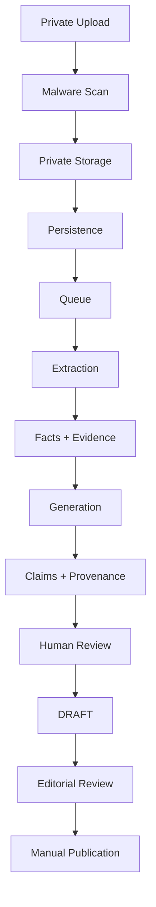

# PHASE 17.18.8 — FINAL STATUS

## Decision

# GO WITH LIMITATIONS

هذا القرار يخص **جاهزية طبقة الحماية والتدقيق فقط**، ولا يعني تفعيل AI أو السماح بعمليات Production. يبقى النظام في حالة `AI DISABLED`، وتبقى جميع عمليات upload وprocessing وgeneration وOCR وpublication مغلقة.

> READINESS ≠ ACTIVATION

لا يوجد دليل تشغيلي يثبت تهيئة provider أو private storage أو malware scanner أو queue/worker أو OCR أو Production persistence. لذلك لم تُحوّل أي حالة `REQUIRES_CONFIGURATION` إلى `READY`، ولم تُستخدم اختبارات Mock أو build أو unit tests كدليل على جاهزية infrastructure.

## Critical Findings

لم يظهر في التدقيق الساكن والاختبارات الآمنة أي **P0 active vulnerability** في المسارات المفحوصة: لا يوجد مسار نشر تلقائي، ولا كشف أسرار، ولا وصول AI غير مصرح به مثبت، ولا arbitrary code execution path، ولا Production mutation نفّذته هذه المرحلة.

توجد **قيود P1 قبل التفعيل** وليست ثغرات نشطة في النظام المعطل حاليًا. وتشمل عدم تهيئة provider وprivate storage وmalware scanner وqueue/worker وOCR وretention وcost controls وdistributed rate limits وProduction observability، إضافة إلى بقاء migrations 0007–0009 غير مطبقة. هذه العناصر تمنع Activation لكنها لا تبرر ادعاء `NO-GO` طالما بقيت البوابات مغلقة ولم تُنفذ عمليات Production.

كما توجد قيود P2 خارجية تتعلق باختبارات المتصفحات المتعددة، screen reader، وقياس WCAG 2.2 AA. لا تُعد هذه النتائج PASS ما لم تُقاس فعليًا.

## Security

| Area | Finding | Status | Evidence | Severity |
|---|---|---|---|---|
| Authentication | Admin routes وAI APIs تعتمد على session/principal server-side؛ cookie flags مضبوطة (`httpOnly`, `sameSite=lax`, `secure` في Production، TTL محدود). | READY_WITH_LIMITATIONS | `lib/admin/auth.ts` و`lib/admin/http.ts` | لا يوجد P0 مثبت |
| RBAC | `ADMIN` و`SUPER_ADMIN` يحتفظان بصلاحيات الإدارة؛ `EDITOR` يملك read/review دون generation؛ `MODERATOR` لا يملك AI scope؛ لم توسع الصلاحيات. | READY | `lib/admin/rbac.ts` والاختبارات | لا يوجد blocker نشط |
| CSRF / same-origin | جميع AI POST routes المفحوصة تستخدم `requirePermissionPrincipal` و`isSameOriginMutation`. | READY_WITH_LIMITATIONS | mutation route audit و`lib/user/requestSecurity.ts` | يلزم اختبار تشغيل مستقل عند التفعيل |
| Prompt injection | fixed system instructions منفصلة عن `DOCUMENT_DATA`؛ المحتوى المستخرج يعامل كبيانات غير موثوقة؛ الأدوات والأسرار والصلاحيات والنشر محظورة. | READY_WITH_LIMITATIONS | `lib/ai/generation/prompt.ts` و`validation.ts` | يلزم provider-specific test |
| Data exfiltration | provider payload allowlisted ومحدود؛ لا يضم `DATABASE_URL` أو session secrets أو storage credentials أو unrelated records. | READY_WITH_LIMITATIONS | `lib/ai/operations.ts` واختبار payload | يلزم مراجعة provider الفعلي |
| Unsafe output | malformed/oversized output، secret-like values، instruction-like output، unsupported URLs، missing evidence/provenance، conflicts، وauto-verified claims تُرفض أو تعزل. | READY_WITH_LIMITATIONS | `lib/ai/generation/validation.ts` | لا يوجد bypass مثبت |
| Audit | audit mapper يسجل actor/entity/field/old/new/action/reason، وgeneration persistence تسجل request/attempt/completion/review. | READY_WITH_LIMITATIONS | `lib/ai/audit.ts` و`generation/persistence.ts` | persistence غير مثبتة في Production |

## Privacy

البيانات الخاصة بالـAI documents وraw extracted text وfacts وevidence وreview notes وstorage keys لا تدخل public projection أو public search أو sitemap أو OG أو JSON-LD بحسب التدقيق الساكن وpublic privacy scan. التخزين مصمم `private-by-default` مع signed retrieval كعقد، لكن bucket حقيقية وcredentials خاصة لم تُنشأ.

لا تحتوي telemetry المسموح بها على raw CV أو raw extracted text أو full prompt أو full AI output أو evidence excerpts أو secrets أو cookies. تبقى retention/deletion/orphan cleanup غير مهيأة، ولذلك لا يوجد تصريح بالتفعيل.

## AI Safety

التدفق المنطقي المحمي هو:

لا ينشر AI مباشرة، ولا ينشئ Person أو Profile منشورًا تلقائيًا، ولا يتجاوز Human Review، ولا يحول unverified claims إلى public facts. كل ذلك يمثل حدودًا برمجية وعقدية؛ أما إثبات التشغيل تحت provider حقيقي فيتطلب مرحلة خارج هذه المهمة.

## Publication Boundary

`AI_PUBLICATION_ENABLED` ثابت `false`، كما أن `AI_PRODUCTION_ENABLED` وupload وprocessing وgeneration وOCR ثابتة `false`. عقد generation يتطلب `DRAFT`، والتحقق يمنع claim بحالة `VERIFIED` من AI تلقائيًا. لا توجد publication mutation في AI workspace أو generation route، ولا يوجد مسار تلقائي لإنشاء Person/Profile.

Public search وsitemap يقرآن published people/public profiles فقط ولا يقرآن AI documents أو AI jobs أو AI facts أو AI claims. هذه العزلة مثبتة باختبارات source-level وProduction GET-only privacy scan، وليست دليلًا على تفعيل AI.

## Infrastructure Readiness

| Capability | Status | Evidence | Owner | Verification method | Blocker |
|---|---|---|---|---|---|
| AI Provider | REQUIRES_CONFIGURATION | لا executable provider؛ reachability غير مختبرة؛ لا call | AI Platform Owner | تهيئة provider sandbox، health/reachability، model/timeout/retry test | نعم قبل Activation |
| Private Storage | REQUIRES_CONFIGURATION | private contract؛ لا bucket Production؛ signed retrieval غير مهيأ | Platform/Security Owner | provision خاص، ACL، signed retrieval، retention test | نعم قبل Activation |
| Malware Scanner | REQUIRES_CONFIGURATION | adapter حالات CLEAN/INFECTED/ERROR/UNAVAILABLE؛ لا scanner فعلي | Security Operations | scanner integration وfail-closed tests | نعم قبل Processing |
| Queue | REQUIRES_CONFIGURATION | idempotency/retry/stale policy موجودة؛ لا durable queue | Reliability Owner | duplicate/retry/cancel/stale-job test | نعم قبل Processing |
| Worker | REQUIRES_CONFIGURATION | لا worker Production مثبت | Reliability Owner | lease/timeout/retry/termination test | نعم قبل Processing |
| OCR | DISABLED | `AI_OCR_ENABLED=false`؛ scanned PDF يبقى `OCR_REQUIRED` | AI Platform Owner | OCR provider مستقل مع page/language/cost bounds | نعم عند الحاجة |
| Persistence | REQUIRES_CONFIGURATION | AI tables migration-gated | Database Owner | isolated migration apply/verify ثم repository integration | نعم قبل Persistence |
| Migrations | REQUIRES_CONFIGURATION | 0007/0008/0009 CREATED / NOT APPLIED في هذه المرحلة | Database Owner | syntax/order/FK/index/constraint review ثم authorization منفصل | نعم قبل Persistence |
| Retention | REQUIRES_CONFIGURATION | automatic deletion false؛ executor غير مهيأ | Privacy/Data Governance | retention/cascade/orphan/delete rehearsal | نعم قبل Storage |
| Rate Limiting | READY_WITH_LIMITATIONS | static bounded limits؛ distributed per-user/per-role غير مهيأ | Security Operations | distributed upload/processing/generation/concurrency test | نعم قبل Activation |
| Cost Controls | REQUIRES_CONFIGURATION | pricing/budget/circuit breaker غير مهيأة | Product/Finance Owner | model pricing، budgets، alerts، circuit-breaker test | نعم قبل Provider |
| Observability | READY_WITH_LIMITATIONS | allowlisted content-safe fields؛ Production metrics/traces غير موصلة | Reliability/Security | privacy-safe logs/metrics/traces وalerting/retention review | نعم قبل Activation |
| Audit | READY_WITH_LIMITATIONS | taxonomy/mapper موجودان؛ لا Production AI event | Security/Editorial | isolated persistence-backed audit verification | نعم قبل Activation |
| RBAC | READY | Admin-only endpoint؛ mutation permissions محفوظة؛ Moderator بلا AI | Security/Platform Owner | role matrix and negative authorization tests | لا، مع بقاء gates OFF |
| Prompt Boundary | READY_WITH_LIMITATIONS | system/document separation واختبارات injection موجودة؛ no real provider call | AI Safety Owner | approved-provider red-team test | نعم قبل Provider |
| Human Review | REQUIRES_CONFIGURATION | UI/contracts موجودة؛ persistence/reviewer audit pending migrations | Editorial Owner | end-to-end claim review and audit test | نعم قبل Draft persistence |
| Publication Guard | READY | DRAFT-only contract؛ لا auto Person/Profile/publication path | Editorial/Security Owner | negative publication test and public projection scan | لا، guard نشط |
| Rollback | READY_WITH_LIMITATIONS | gates OFF وnormal Git rollback؛ لا live infrastructure rehearsal | Release/Reliability Owner | rehearsal لكل provider/queue/storage/database layer | نعم قبل Activation |
| Generation | DISABLED | `AI_GENERATION_ENABLED=false` وglobal production gate | AI Platform Owner | separate activation change with approvals | نعم |
| Privacy Firewall | READY_WITH_LIMITATIONS | public isolation scan نجح؛ storage الحقيقي غير مهيأ | Privacy/Security Owner | signed URL, ACL, access-log, deletion review | نعم |

## Migration Status

لم تُطبق أي migration. بقيت الملفات التالية `CREATED / NOT APPLIED`:

| Migration | Review result | Applied? |
|---|---|---|
| `0007_phase17_16_media_architecture.sql` | additive tables/indexes/constraints؛ storage-key and MIME checks؛ restrictive person-media relation | No |
| `0008_phase17_18_2_ai_ingestion_review.sql` | additive AI document/processing/source/fact/evidence/review tables؛ owner/checksum/status/size constraints | No |
| `0009_phase17_18_4_ai_generation.sql` | additive generation/attempt/claim/review tables؛ retry/quality/provenance/JSON bounds | No |

تمت مراجعة ordering وforeign keys وindexes وconstraints وnaming وabsence of destructive statements. لم يُشغّل migration runner، ولم تُنفذ Production DDL/DML، ولا يوجد rollback destructive موصى به. إذا لزم التطبيق مستقبلًا، يكون عبر تفويض مستقل وبيئة معزولة وخطة additive rollback، وليس عبر حذف أو emergency SQL.

## Test Results

| Check | Result | Evidence |
|---|---|---|
| `pnpm install --frozen-lockfile` | PASS | lockfile مطابق؛ لا dependency changes |
| `pnpm typecheck` | PASS | TypeScript 6.0.2 بلا أخطاء |
| `pnpm lint` | PASS | بلا أخطاء أو warnings |
| `pnpm test` | PASS | 25 test files / 172 tests |
| `pnpm build` | PASS | Next.js 16.3.1؛ 71/71 generated pages |
| `git diff --check` | PASS | لا whitespace errors |
| `pnpm test tests/phase17.18.7.test.ts` | PASS | 12 tests |
| `pnpm test tests/phase17.18.8.test.ts` | PASS | 10 tests |
| `pnpm test:integration` | NOT RUN | محظور لأنه ينفذ migration/seed |

اختبارات Phase 17.18.8 تتضمن 10 اختبارات آمنة تغطي gates، matrix vocabulary، prompt boundary، provider payload، mutation guards، publication firewall، file safety، migration safety، rollback/retention/cost/observability، والتوثيق السابق. لا تُستخدم هذه الاختبارات كدليل على جاهزية infrastructure.

## Production Read-only Verification

تم فحص deployment المرتبط مباشرة بcommit التنفيذ `38ef2913c3e02b9ee0a91f3979b16de65dcb6e1d` عبر Vercel read-only. deployment ID هو `dpl_8wihQxSRfHDHQYA47hKXrTXhp1Fx`، والهدف Production، والحالة `READY`، والalias هو `https://a3-lam.vercel.app`.

تم تنفيذ GET-only smoke على alias `https://a3-lam.vercel.app`:

| Route | Result |
|---|---|
| `/` | 200 |
| `/api/health` | 200 |
| `/categories` | 200 |
| `/search` | 200 |
| `/robots.txt` | 200 |
| `/sitemap.xml` | 200 |
| `/admin` | 307 إلى تسجيل الدخول |
| `/admin/ai` | 307 إلى تسجيل الدخول |
| `/api/admin/ai/readiness` | 401 للمستخدم المجهول |

اجتاز public privacy scan المسارات العامة دون ظهور AI document/job markers أو raw document metadata أو provider secrets أو `DATABASE_URL` أو session token markers. لم ينفذ التدقيق POST أو PUT أو PATCH أو DELETE أو upload أو document/job creation أو generation أو review أو publication.

لم يُستخدم Admin session ولم تُنفذ أي عملية mutation أثناء هذا التدقيق. أدلة Production هنا anonymous/read-only فقط؛ لا تُعد تصريحًا برفع مستندات أو تشغيل generation. deployment الجاهز المذكور هو آخر deployment مرتبط مباشرة بتغيير الكود لهذه المرحلة.

## Counters

الأرقام أدناه تخص هذه المرحلة، ويمكن إثباتها من نطاق التنفيذ وسجلات الأوامر؛ لا توجد عمليات Production فعلية في هذه المرحلة:

| Counter | Value |
|---|---:|
| AI inference calls | 0 |
| Provider calls | 0 |
| Production uploads | 0 |
| Production documents | 0 |
| Production jobs | 0 |
| Production mutations | 0 |
| People created | 0 |
| Profiles created | 0 |
| Public AI profiles | 0 |
| Migrations executed | 0 |
| Production DDL | 0 |
| Production DML | 0 |
| Seeds | 0 |
| Secrets changed | 0 |
| Providers configured | 0 |
| DNS changes | 0 |
| Vercel configuration changes | 0 |

## Git

| Field | Value |
|---|---|
| Branch | `main` |
| Implementation commit | `38ef2913c3e02b9ee0a91f3979b16de65dcb6e1d` |
| Branch at implementation push | `main` |
| Equality after implementation push | `HEAD == origin/main` |
| Documentation closeout | Pushed as a normal docs-only commit after implementation |
| Final local state | Verified clean in final closeout command |
| Working tree | clean |
| History safety | no reset, no rebase, no force-push, no history rewrite |

## Deployment

**Latest known functional deployment for this phase:** `dpl_8wihQxSRfHDHQYA47hKXrTXhp1Fx`, Production, `READY`, linked to implementation commit `38ef2913c3e02b9ee0a91f3979b16de65dcb6e1d`.

**Current closeout:** implementation commit `38ef2913c3e02b9ee0a91f3979b16de65dcb6e1d` was pushed normally. The final report and audit notes are documentation-only additions relative to the implementation commit and do not change runtime behavior. The verified Vercel deployment for the implementation commit is `dpl_8wihQxSRfHDHQYA47hKXrTXhp1Fx`, READY on Production.

## Limitations

This phase did not configure or activate any external provider, storage, scanner, queue, worker, OCR, retention executor, distributed rate limit, cost control, or production observability. It did not apply migrations, create synthetic Production data, use a real CV, read or change secrets, or alter Vercel environment variables.

The readiness model is architectural and evidence-aware, but the following remain unverified until a separately authorized environment exists: provider reachability and pricing, private bucket ACLs and signed retrieval, malware integration, durable queue/worker behavior, OCR quality and cost, persistence-backed audit/review writes, distributed rate limits, live rollback rehearsal, and external browser/screen-reader/WCAG verification.

The absence of an active P0 finding is not permission to activate AI. Any future evidence of public private-data leakage, unauthorized access, publication bypass, secret exposure, arbitrary code execution, destructive mutation, or uncontrolled provider calls changes the decision to `NO-GO` and requires P0/P1 escalation.

## Required Next Step

لا توجد خطوة تنفيذية تلقائية بعد هذا التقرير. الخطوة التالية الوحيدة المسموح بها هي قرار مستقل يحدد البيئة والاعتماديات المطلوبة، ثم تهيئة كل dependency في sandbox معزول ومراجعة الأمن والتكلفة والخصوصية، وتطبيق migrations فقط بتفويض منفصل، وإجراء full lifecycle test ينتهي بـDRAFT تحت Human Review. يجب إبقاء publication مغلقًا حتى اعتماد editorial workflow منفصل.

> A3LAM AI must assist the editor, not replace the editor.

## References

1. `docs/phase17.18.7-completion-report.md` — previous readiness baseline and counters.
2. `docs/phase17.18.6-completion-report.md` — Editorial Workspace and draft-only baseline.
3. `lib/ai/activation.ts` — feature gates and publication guard.
4. `lib/ai/readiness.ts` — central readiness aggregation.
5. `lib/ai/generation/prompt.ts` and `lib/ai/generation/validation.ts` — prompt/data boundary and output validation.
6. `lib/ai/generation/persistence.ts` — idempotency, retry, provenance, review, and audit behavior.
7. `lib/db/schema.ts` and `drizzle/migrations/0007_phase17_16_media_architecture.sql`, `0008_phase17_18_2_ai_ingestion_review.sql`, `0009_phase17_18_4_ai_generation.sql` — schema and migration evidence.
8. `tests/phase17.18.7.test.ts` and `tests/phase17.18.8.test.ts` — safe local security/readiness tests.

**STOP AFTER PHASE 17.18.8.**
